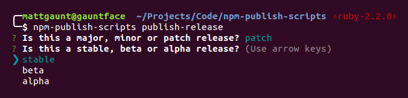

# Publishing a Release

When you want to publish to NPM there are a few steps that should be taken
before anything is published.

1. **Build** the project. An example would be minifying
   code for use in browsers.
1. **Test** the project. Making sure what is released actually works.

The `publish-release` command will look for **NPM Run Scripts** that perform
each of the above steps, `build` and `test`.

If you have a build process (i.e. running `gulp` to minify / alter your
code before a release) configure it in the `build` NPM script.

The `test` NPM run script should run any tests you have for you project.

Here's an example set of NPM scripts:

```json
"scripts": {
  "build": "gulp build",
  "test": "npm run lint && mocha",
  "lint": "eslint ./**/*.js",
}
```

You don't need to have these commands, but most projects will have one or both
of these scripts.

# Performing a Release

To kick of a release, simply run the following:

    npm-publish-scripts publish-release

This will then guide you through the release asking you required permissions.



A release version is grouped into patch, minor or major and you'll be asked
whether this release should be tagged as alpha, beta or stable.

> When you first start using this module you probably want to
> perform releases using the `alpha` or `beta` label in case there are
> any issues. Otherwise you can escape the release process before the final
> confirmation to test it out.

# Controlling Files Being Shipped

When publishing a module to NPM you should be considerate of what files you
publish. Save bytes for developers and users of your modules.

Make use of`.npmignore` to ensure files that aren't required are
[excluded from the final release](https://docs.npmjs.com/misc/developers#keeping-files-out-of-your-package).

If you have particular files and directories you wish to include you can
use the `files` parameter in [package.json](https://docs.npmjs.com/files/package.json#files).

This project has the following in `files` configuration in package.json.

    "files": [
      "build/",
      "src/"
    ]

With this NPM will publish generic files like README and LICENSE, but will also
include *just* the 'build/' and 'src/' directories, 'docs/' are excluded.

If you want to test what will be published run `npm pack`, which will create
an example tar of what will be shipped.
